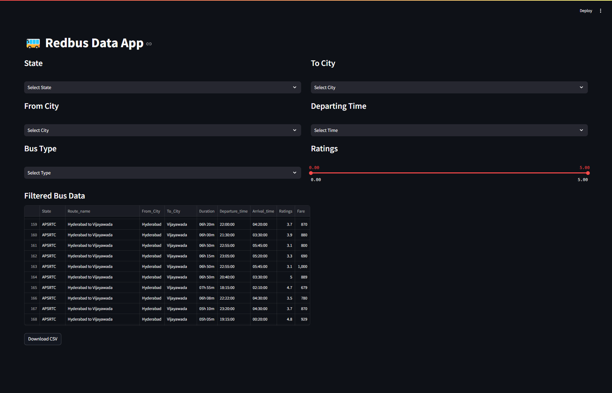

# Redbus Website Scraping Project

This project involves scraping data from the Redbus website using Selenium, storing the data in a MySQL database, and creating a Streamlit app for data filtration.

## Project Structure

- **Selenium**: Used for web scraping to extract data from the Redbus website.
- **MySQL**: Database to store the scraped data.
- **Streamlit**: Web application framework to create an interactive data filtration interface.

## Requirements

- Python 3.x
- Selenium
- MySQL
- Streamlit
- Pandas
- Numpy

## Setup Instructions

1. **Clone the repository**:
    ```bash
    git clone <[repository-url](https://github.com/yasararafath-s/Redbus_website_scraping_project.git)>
    cd <Redbus_website_scraping_project>
    ```

2. **Install dependencies**:
    ```bash
    pip install -r requirements.txt
    ```

3. **Configure MySQL**:
    - Create a database and update the connection details in the script.

4. **Run the scraper**:
    ```bash
    redbus_scraping-sql.ipynb
    ```

5. **Start the Streamlit app**:
    ```bash
    streamlit run redbus-data_app.py
    ```

## Usage

- Run the scraper to collect data from the Redbus website.
- Use the Streamlit app to filter and visualize the data.

## Screenshot


